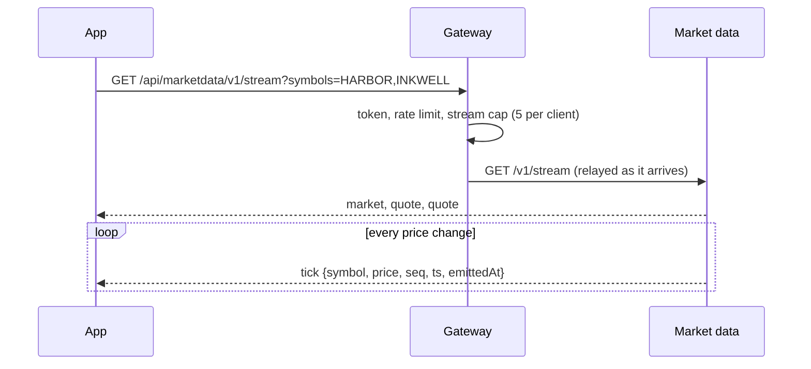
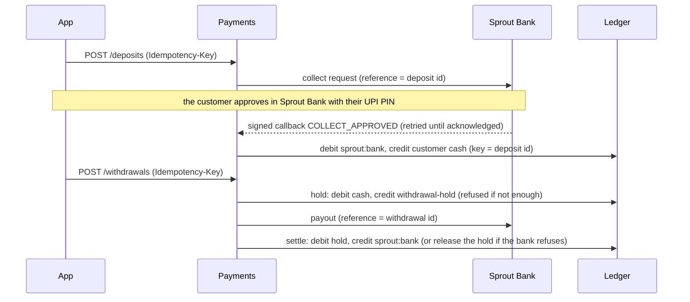
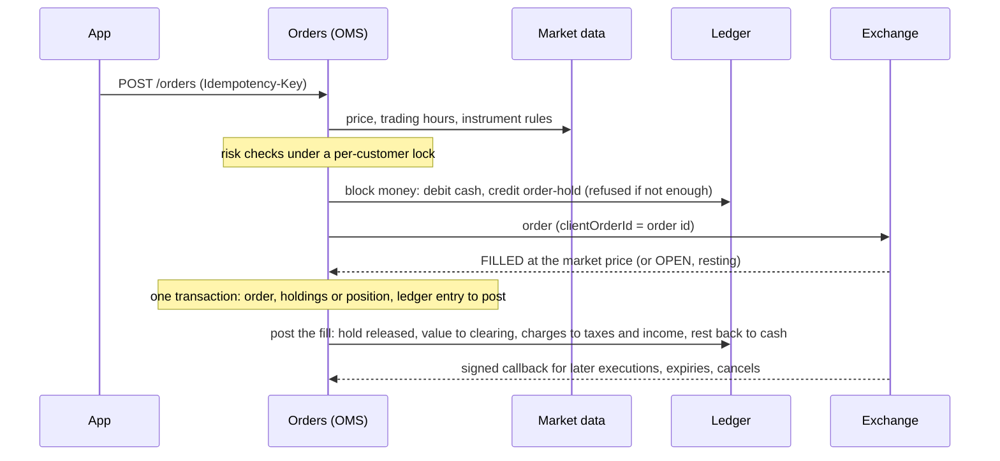
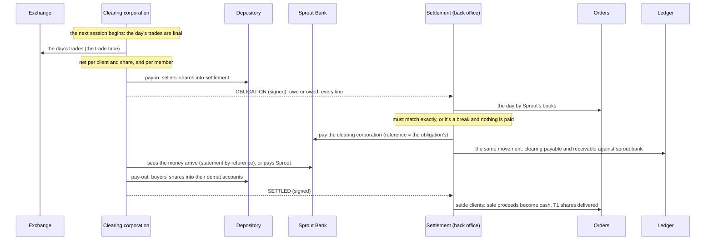

# Architecture

## Services, not layers

Each service owns one responsibility and its own data. No service reads another's tables; they talk
only through the published [contracts](contracts.md). That is the rule that lets a large organisation
have many teams change things independently, and it is the rule here even though one person writes it.

| Service | Owns | Never does |
|---|---|---|
| Gateway | The public edge: routing, verifying access tokens, rate limits, security headers, request ids | Store anything; know what a password is |
| Identity | Users, password hashes, two-factor secrets, sessions, refresh tokens, signing keys | Know about money or orders |
| Market data | The simulated market: instruments, the market clock, prices, candles; publishing every price change | Know who is watching or what they own |
| Accounts | Who the customer is (simulated KYC) and which bank account their money comes from | Hold money |
| Ledger | The money: double-entry books, balances, the journal | Know why money moves, or talk to banks |
| Payments | Each payment's story: deposits by UPI collect, withdrawals by payout, reconciliation | Hold balances (the ledger does) |
| Orders (OMS) | Customers' orders, the risk checks before them, holdings, intraday positions, charges | Execute trades (the exchange does) or hold money (the ledger does) |
| Sprout Bank | *Not Sprout*: a simulated customer bank with UPI PINs, so money can move end to end | Know anything about Sprout's books |
| Plans | Systematic investment plans: a monthly amount into a share, bought through the order service | Decide whether an order may go ahead (the order service does) |
| Habits | Streaks, levels, badges, points, monthly challenges, Year Wrapped, squads, readiness and Future You, worked out from trading history | Reward trading volume, or rank people by money |
| Goals | Pots invested in a share, with targets; round-ups from UPI spends, swept under AutoPay | Hold money itself (the ledger does), or take money without a mandate |
| Rewards | What vested habit points buy (the vault), and referral rewards | Store points (habits works them out), or reward a sign-up |
| Statements | A customer's records: contract notes, funds statements, tax P&amp;L, holdings statements, read from the books | Store anything (it has no database) |
| Reconciliation | Comparing every book with every other it should agree with, every day | Fix anything (a break is for a person) |
| Settlement | Sprout's back office: checks each day's obligation against Sprout's books, moves and books the money, settles clients | Decide what was traded (the order service and the exchange do) |
| Sprout Stock Exchange | *Not Sprout*: a simulated exchange that executes brokers' orders against the simulated market | Know who Sprout's customers are or what they own |
| Sprout Clearing Corporation | *Not Sprout*: nets each day's trades and settles them T+1 between members, the depository and the bank | Know anything about a member's books |
| Sprout Depository | *Not Sprout*: holds investors' shares in demat accounts; moves them only on instruction | Know prices or money |

## A request, end to end

1. The gateway gives the request an id (or keeps a valid one), and strips any header a client could use
   to pretend to be someone else (`X-User-Id` and friends). It also drops any trace a client sends
   (`traceparent` and the like) and starts its own, so no one can attach their requests to someone
   else's trace or force sampling.
2. It applies the rate limit for that client and route. Sign-in routes get a much tighter limit.
3. For a protected route it verifies the access token locally against identity's published keys
   (JWKS, cached), then forwards the request with the verified user id.
4. It forwards with a 2 s connect and 5 s total timeout behind a circuit breaker, so a sick service
   fails fast instead of piling up waiting requests.
5. Identity answers. Every error is an [RFC 9457 problem](errors.md) with a stable `code`.

Every call any service then makes to another carries the same request id (`X-Request-Id`) and the
gateway's trace (W3C `traceparent`), so one customer action can be followed through every service's logs,
and appears as one trace when traces are exported
([TRACE-01](testing/chaos.md#trace-01), [ADR-020](decisions.md#adr-020-one-request-one-trace)).
Work a service starts on a schedule carries that work's own trace.

## Sign-in and tokens

- Passwords: bcrypt, NIST SP 800-63B rules (length over complexity: 10 to 128 characters, not a well-known
  password, not your email's name), five failures
  lock the account for 15 minutes.
- Two-factor: TOTP (RFC 6238) written from scratch; secrets encrypted with AES-GCM; each code works once.
- Access tokens: RS256 JWTs, 15 minutes, verified by any service with the public key.
- Refresh tokens: opaque, stored hashed, rotated on every use. Using an old one twice means it was
  stolen, so the whole session ends ([E2E-30](testing/e2e.md#e2e-30)).

## Live prices

Prices reach the app as a Server-Sent Events stream: one long HTTP response that carries an event per
price change. It works through Cloudflare and proxies like any HTTP request, and a browser reconnects
it by itself.

Two decisions keep it safe at any load ([ADR-009](decisions.md#adr-009-sse-with-conflation)):

- **Nobody waits on a slow client.** The market engine only records each tick as the newest for that
  symbol on every interested stream; each stream's own virtual thread sends what's pending. A client
  that can't keep up gets the newest price and skips the ones in between (conflation), so it can
  neither slow the market down nor make the service hold a growing backlog for it.
- **Open streams are counted.** The gateway caps streams per client and in total, and relays them on
  virtual threads, so a thousand idle streams cost memory, not request threads.

Every tick is also published to NATS as a `marketdata.tick` event for the services that will need
prices (orders, risk, the ledger). Clients never depend on NATS, so prices keep flowing when it is
down ([CHAOS-02](testing/chaos.md#chaos-02)).

## Money in and out

The ledger is the only place balances live. Payments drives each payment through the ledger and the
bank so that any step can be repeated safely and nothing is ever guessed.

- **The bank's approval is the truth.** An approved collect request is credited even if payments had
  given up on the deposit.
- **Unknown outcomes are retried, never guessed.** A withdrawal whose payout got no answer stays
  `PROCESSING` with its money held; the reconciler repeats the idempotent payout until the bank answers
  ([CHAOS-04](testing/chaos.md#chaos-04)). A callback that arrives while payments is down is retried
  by the bank ([CHAOS-05](testing/chaos.md#chaos-05)).
- **The books are checked against the bank** after every pre-prod run ([RECON-01](testing/chaos.md#recon-01)).

## Trading

An order goes from the customer to the order service (OMS), which checks it and blocks its money in the
ledger, then to the Sprout Stock Exchange, which executes it against the simulated market. The
exchange's answer, or its signed callback, or (if both are lost) the OMS asking it, books the execution.

- **Delivery (`CNC`)**: a buy blocks its value plus charges; the execution takes the real value and
  charges and gives back the rest. Shares bought today are T1 until settlement. A sell needs the shares
  (counting those already being sold); its proceeds are `unsettled` until T+1.
- **Intraday (`MIS`)**: 5x leverage, so a fifth of the value is held as margin while the position is open;
  short selling allowed. Closing books the profit (to `unsettled`) or loss (from the margin). Every
  position is closed by Sprout at 15:20 (₹50 + GST), or earlier if its loss reaches 90% of its margin; a
  loss beyond the customer's money becomes dues, recovered from their next deposit.
- **Charges** are a discount broker's: no delivery brokerage, intraday ₹20 or 0.03%; STT, exchange
  charges, SEBI fees, stamp duty and GST, each to its own ledger account.
- **After-market orders** wait in the OMS and go out at the next open.
- **Unknown outcomes are asked about, not guessed.** An order the exchange never confirmed stays
  `PENDING`; the OMS asks the exchange, and rejects it (releasing its money) only once the exchange
  says it never got it ([CHAOS-06](testing/chaos.md#chaos-06)).
- **Orders, the exchange and the ledger are reconciled** after every pre-prod run
  ([RECON-02](testing/chaos.md#recon-02)).

## Settlement (T+1)

A trade isn't finished when it executes: the shares and the money change hands on the next trading day.
Three outside parties do it, as in India, and Sprout's back office checks every step against its own
books.

- **Every customer has a demat account**, opened with their Sprout account (Sprout is their
  depository participant) and registered with the clearing corporation under their client code.
- **Nothing is paid on trust.** The obligation must equal Sprout's books exactly (the money, and
  every client's shares bought and sold); otherwise the settlement stops as a break for a person to
  look at ([runbook](runbooks.md#a-settlement-is-a-break)).
- **A short delivery** (a client sold shares they didn't deliver) is closed out in cash at 20% above
  the sale price and charged to the client as dues.
- **Every step can be repeated and resumes after a crash**: depository instructions have fixed ids,
  payments the obligation's reference, ledger entries fixed keys.
- **Checked after every pre-prod run**: a whole day settles end to end ([SETTLE-01](testing/chaos.md#settle-01)),
  and afterwards demat holdings, unsettled money and clearing balances agree everywhere
  ([RECON-03](testing/chaos.md#recon-03)).

## The habit, not the hype

Sprout is built to reward investing regularly, never trading often.

- **Plans (SIPs)**: a monthly amount into a share, on the customer's day. Each instalment is a delivery
  market buy of whole shares, placed through the order service on the customer's behalf (same checks,
  same charges) and tagged `sip:<plan>`. A month is claimed before its order is placed, and the order
  goes under a key made from (plan, month), so a retry never buys twice. Months that couldn't buy are
  recorded with the reason, never bought late.
- **Habits are worked out from history, not stored**: streaks of months with a delivery purchase (with
  freezes for a missed month), levels, badges, and points that vest only if the shares stay invested 30
  days. Selling doesn't break a streak; intraday trading doesn't count. A burst of trading shows a nudge,
  never a block.
- **Squads** rank friends by the habit (streak, then months invested in the last year), never by
  money; someone can show a range for how much they've invested, never the amount.
- **Readiness** (emergency fund, high-interest debt, horizon) gives plain advice before a first
  investment, and **Future You** shows what a monthly amount could grow to.

## Goals and round-ups

A **pot** saves towards something with a target and, if the customer likes, a date, and invests in one
share. Money put in is the customer's own Sprout cash, set aside for the pot (never more than they have
free across all pots); the goals service buys whole shares with it through the order service, tagged
`goal:<pot>`, and what doesn't make a share waits for the next buy.

**Round-ups** are how real micro-investing apps work, end to end:

1. The customer sets up **AutoPay** in payments: Sprout asks Sprout Bank for a UPI AutoPay mandate (a
   limit per debit, a stated purpose, and permission to share their spends). The customer approves it
   once, in the bank, with their PIN.
2. Each UPI payment the customer makes (to a demo merchant) is reported by the bank to Sprout, through
   the bank's outbox in the payment's own transaction. Payments keeps these spends in arrival order.
3. Goals reads the spends from where it got to (a cursor), and rounds each up for customers with
   round-ups on: to the next ₹10, ₹50 or ₹100, one to three times over. A spend's id makes reading it
   twice harmless.
4. Once ₹100 is waiting, goals claims it for one **sweep** and asks payments to debit that much under
   the mandate (the sweep's id is the debit's reference, so asking again never takes twice). The money
   lands in the customer's Sprout balance through the ledger, like a deposit, and the pot buys its share.

A refused sweep (the mandate revoked, not enough in the bank) leaves the round-ups waiting and isn't
tried again for an hour; an unknown outcome is asked again with the same reference
([ADR-021](decisions.md#adr-021-round-ups)).

## Rewards

What a customer can spend in the **vault** is their vested habit points (earned by investing month after
month, kept only if the money stays invested), plus referral rewards, less what they've spent. It is
worked out from habits each time, never stored, and a redemption is decided under a per-customer lock so
two at once can't spend the same points. The vault's brands are fictional. **Referrals** reward the
habit, not the sign-up: both get 500 points once the new customer has invested in 3 different months
([ADR-022](decisions.md#adr-022-rewards)).

## Records and reconciliation

**Statements are read, never stored.** Contract notes, funds statements, profit and loss and holdings
statements are built each time from the books that own the facts: executions from the order service,
cash movements (with running balances) from the ledger, shares from the depository. Nothing is copied,
so a statement can't disagree with the books it came from. Profit and loss follows the tax rules:
delivery sales matched to purchases first in, first out, long-term after a year, intraday separate.

**Reconciliation runs every day inside Sprout**, not only in pre-prod. Once each session (after midday
market time, when the previous day has settled) and on demand, it compares seven pairs of books through
their owners' APIs: the ledger with itself and with the bank; customers' held and unsettled money with
their orders; executions with the exchange's trades; demat holdings with delivered shares; and the
settlements. Records that move are compared twice, a moment apart, so money in flight isn't reported as
a break; a book that can't be read is an `ERROR`, never a pass. Pre-prod checks that it agrees with the
SQL reconciliations at the end of every run ([RECON-04](testing/chaos.md#recon-04)).

## Running many services on a phone

Each JVM costs memory before it does any work. Measured on the phone-sized budget:

| Setup | Memory |
|---|---|
| One Spring Boot service, JDBC, tuned JVM | ~147 MB |
| Same with JPA/Hibernate | ~206 MB |
| Four services as separate contexts in **one** tuned JVM | ~170 MB total |

So services are built and versioned separately, but deployed together in **hosts**: one JVM per group,
each service in its own Spring context with its own config, port and database schema. See the
[decision record](decisions.md#adr-003-shared-jvm-hosts).

| Host | Services | Memory limit | Why together |
|---|---|---|---|
| edge | gateway, identity | 384 MB | Every request touches both |
| trading | market data, orders (with risk), plans, habits, rewards | 320 MB | The trading path; kept apart from sign-in so its faults can't stop people signing in ([ADR-010](decisions.md#adr-010-trading-host), [CHAOS-03](testing/chaos.md#chaos-03)); orders read prices on every placement and risk round |
| money | ledger, accounts, payments, settlement, statements, reconciliation, goals | 320 MB | A payment needs all three, so they fail together anyway ([ADR-012](decisions.md#adr-012-money-host)) |
| street | Sprout Bank, the Sprout Stock Exchange, the clearing corporation, the depository | 320 MB | The outside parties, simulated, kept apart from Sprout's own hosts as the real ones are |
