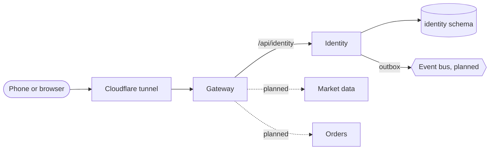

# Architecture

## Services, not layers

Each service owns one responsibility and its own data. No service reads another's tables; they talk
only through the published [contracts](contracts.md). That is the rule that lets a large organisation
have many teams change things independently, and it is the rule here even though one person writes it.

| Service | Owns | Never does |
|---|---|---|
| Gateway | The public edge: routing, verifying access tokens, rate limits, security headers, request ids | Store anything; know what a password is |
| Identity | Users, password hashes, two-factor secrets, sessions, refresh tokens, signing keys | Know about money or orders |

## A request, end to end

1. The gateway gives the request an id (or keeps a valid one), and strips any header a client could use
   to pretend to be someone else (`X-User-Id` and friends).
2. It applies the rate limit for that client and route. Sign-in routes get a much tighter limit.
3. For a protected route it verifies the access token locally against identity's published keys
   (JWKS, cached), then forwards the request with the verified user id.
4. It forwards with a 2 s connect and 5 s total timeout behind a circuit breaker, so a sick service
   fails fast instead of piling up waiting requests.
5. Identity answers. Every error is an [RFC 9457 problem](errors.md) with a stable `code`.

## Sign-in and tokens

- Passwords: bcrypt, NIST SP 800-63B rules (length over complexity: 10 to 128 characters, not a well-known
  password, not your email's name), five failures
  lock the account for 15 minutes.
- Two-factor: TOTP (RFC 6238) written from scratch; secrets encrypted with AES-GCM; each code works once.
- Access tokens: RS256 JWTs, 15 minutes, verified by any service with the public key.
- Refresh tokens: opaque, stored hashed, rotated on every use. Using an old one twice means it was
  stolen, so the whole session ends ([E2E-30](testing/e2e.md#e2e-30)).

## Running many services on a phone

Each JVM costs memory before it does any work. Measured on the phone-sized budget:

| Setup | Memory |
|---|---|
| One Spring Boot service, JDBC, tuned JVM | ~147 MB |
| Same with JPA/Hibernate | ~206 MB |
| Four services as separate contexts in **one** tuned JVM | ~170 MB total |

So services are built and versioned separately, but deployed together in **hosts**: one JVM per group,
each service in its own Spring context with its own config, port and database schema. The `edge` host
runs the gateway and identity. See the [decision record](decisions.md#adr-003-shared-jvm-hosts).
