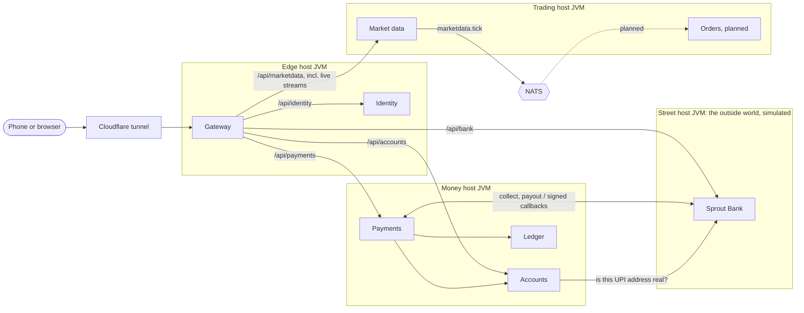
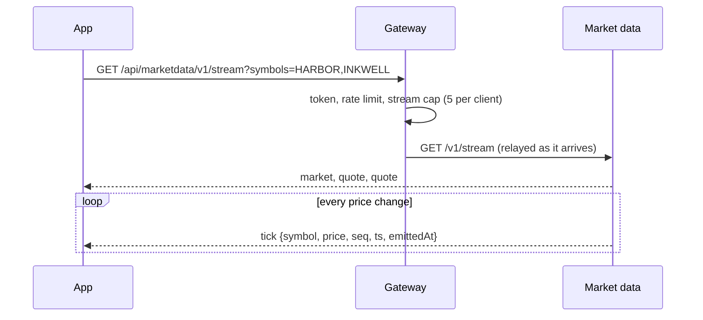
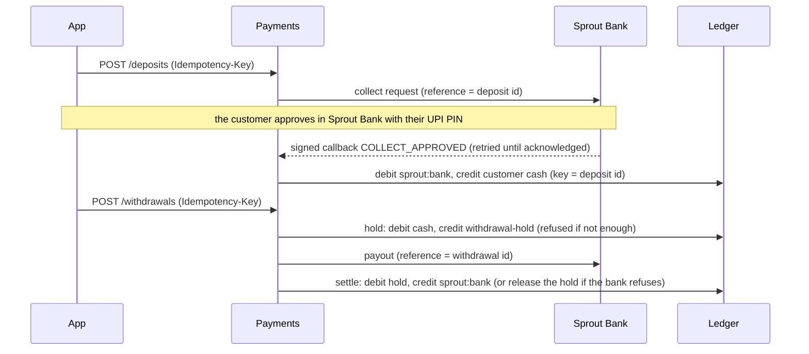

# Architecture

## Services, not layers

Each service owns one responsibility and its own data. No service reads another's tables; they talk
only through the published [contracts](contracts.md). That is the rule that lets a large organisation
have many teams change things independently, and it is the rule here even though one person writes it.

| Service | Owns | Never does |
|---|---|---|
| Gateway | The public edge: routing, verifying access tokens, rate limits, security headers, request ids | Store anything; know what a password is |
| Identity | Users, password hashes, two-factor secrets, sessions, refresh tokens, signing keys | Know about money or orders |
| Market data | The simulated market: instruments, the market clock, prices, candles; publishing every price change | Know who is watching or what they own |
| Accounts | Who the customer is (simulated KYC) and which bank account their money comes from | Hold money |
| Ledger | The money: double-entry books, balances, the journal | Know why money moves, or talk to banks |
| Payments | Each payment's story: deposits by UPI collect, withdrawals by payout, reconciliation | Hold balances (the ledger does) |
| Sprout Bank | *Not Sprout*: a simulated customer bank with UPI PINs, so money can move end to end | Know anything about Sprout's books |

## A request, end to end

1. The gateway gives the request an id (or keeps a valid one), and strips any header a client could use
   to pretend to be someone else (`X-User-Id` and friends).
2. It applies the rate limit for that client and route. Sign-in routes get a much tighter limit.
3. For a protected route it verifies the access token locally against identity's published keys
   (JWKS, cached), then forwards the request with the verified user id.
4. It forwards with a 2 s connect and 5 s total timeout behind a circuit breaker, so a sick service
   fails fast instead of piling up waiting requests.
5. Identity answers. Every error is an [RFC 9457 problem](errors.md) with a stable `code`.

## Sign-in and tokens

- Passwords: bcrypt, NIST SP 800-63B rules (length over complexity: 10 to 128 characters, not a well-known
  password, not your email's name), five failures
  lock the account for 15 minutes.
- Two-factor: TOTP (RFC 6238) written from scratch; secrets encrypted with AES-GCM; each code works once.
- Access tokens: RS256 JWTs, 15 minutes, verified by any service with the public key.
- Refresh tokens: opaque, stored hashed, rotated on every use. Using an old one twice means it was
  stolen, so the whole session ends ([E2E-30](testing/e2e.md#e2e-30)).

## Live prices

Prices reach the app as a Server-Sent Events stream: one long HTTP response that carries an event per
price change. It works through Cloudflare and proxies like any HTTP request, and a browser reconnects
it by itself.

Two decisions keep it safe at any load ([ADR-009](decisions.md#adr-009-sse-with-conflation)):

- **Nobody waits on a slow client.** The market engine only records each tick as the newest for that
  symbol on every interested stream; each stream's own virtual thread sends what's pending. A client
  that can't keep up gets the newest price and skips the ones in between (conflation), so it can
  neither slow the market down nor make the service hold a growing backlog for it.
- **Open streams are counted.** The gateway caps streams per client and in total, and relays them on
  virtual threads, so a thousand idle streams cost memory, not request threads.

Every tick is also published to NATS as a `marketdata.tick` event for the services that will need
prices (orders, risk, the ledger). Clients never depend on NATS, so prices keep flowing when it is
down ([CHAOS-02](testing/chaos.md#chaos-02)).

## Money in and out

The ledger is the only place balances live. Payments drives each payment through the ledger and the
bank so that any step can be repeated safely and nothing is ever guessed.

- **The bank's approval is the truth.** An approved collect request is credited even if payments had
  given up on the deposit.
- **Unknown outcomes are retried, never guessed.** A withdrawal whose payout got no answer stays
  `PROCESSING` with its money held; the reconciler repeats the idempotent payout until the bank answers
  ([CHAOS-04](testing/chaos.md#chaos-04)). A callback that arrives while payments is down is retried
  by the bank ([CHAOS-05](testing/chaos.md#chaos-05)).
- **The books are checked against the bank** after every pre-prod run ([RECON-01](testing/chaos.md#recon-01)).

## Running many services on a phone

Each JVM costs memory before it does any work. Measured on the phone-sized budget:

| Setup | Memory |
|---|---|
| One Spring Boot service, JDBC, tuned JVM | ~147 MB |
| Same with JPA/Hibernate | ~206 MB |
| Four services as separate contexts in **one** tuned JVM | ~170 MB total |

So services are built and versioned separately, but deployed together in **hosts**: one JVM per group,
each service in its own Spring context with its own config, port and database schema. See the
[decision record](decisions.md#adr-003-shared-jvm-hosts).

| Host | Services | Memory limit | Why together |
|---|---|---|---|
| edge | gateway, identity | 384 MB | Every request touches both |
| trading | market data (orders and risk to come) | 256 MB | The trading path; kept apart from sign-in so its faults can't stop people signing in ([ADR-010](decisions.md#adr-010-trading-host), [CHAOS-03](testing/chaos.md#chaos-03)) |
| money | ledger, accounts, payments | 320 MB | A payment needs all three, so they fail together anyway ([ADR-012](decisions.md#adr-012-money-host)) |
| street | Sprout Bank (the exchange, clearing and depository to come) | 256 MB | The outside parties, simulated, kept apart from Sprout's own hosts as the real ones are |
