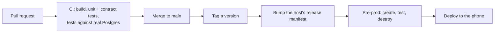

# Environments & releases

## From a change to production

1. **Every repository** protects `main`. Changes arrive by pull request and merge only when CI is green.
2. **A release is a tag**, `vX.Y.Z`.
3. **A host's `pom.xml` is its release manifest**: the exact version of every service it runs. Changing
   a version is a release. Before a host is built, each service is built from its release tag
   ([ADR-011](decisions.md#adr-011-build-from-tags)).
4. **Pre-prod** builds that manifest, tests it and throws it away.
5. **Production** is the phone, deployed only from a manifest that passed pre-prod.

## Pre-prod is disposable

There is no long-lived staging server that drifts from production. For every release,
`preprod/run.sh` creates a fresh environment in Docker from nothing, runs every test, records the
evidence and destroys it, volumes included.

| Container | Purpose | Memory limit |
|---|---|---|
| `postgres` | Postgres 18, the version the phone runs | 256 MB |
| `edge` | The edge host jar (gateway, identity), same JVM flags as production | 384 MB |
| `trading` | The trading host jar (market data), its market running 30 times real speed | 256 MB |
| `money` | The money host jar (ledger, accounts, payments) | 320 MB |
| `street` | The street host jar (Sprout Bank; payment requests expire after 30 s here) | 256 MB |
| `nats` | NATS, for events between services | 64 MB |
| `lgtm` | Grafana, Prometheus, Loki and Tempo (with `--observability`) | 1.5 GB |
| `k6` | Load generator for request/response performance tests | n/a |
| `loadgen` | Java load generator for price streams, on the same clock as the services | n/a |

Limits mirror what the phone can give each host, so a memory regression fails in pre-prod first.
Configuration mirrors production too: identity loads its signing key from a file, as on the phone (a
generated in-memory key once hid a bug in exactly that path; see [Incidents](incidents.md)).

| Stage | Fails the release when |
|---|---|
| Environment | It isn't healthy within the compose health checks |
| [End-to-end](testing/e2e.md) | Any journey or edge case fails |
| [Performance](testing/performance.md) | Any k6 threshold is crossed |
| [Chaos](testing/chaos.md) | Any experiment's hypothesis is disproved |

The evidence from each run is committed under [Evidence from runs](reliability/runs/index.md).

## Production

The phone runs each host as a supervised process behind a Cloudflare tunnel, with structured JSON logs.
Secrets (the two-factor encryption key, the token signing key, database passwords) exist only on the
phone; the repositories are public and contain none.
