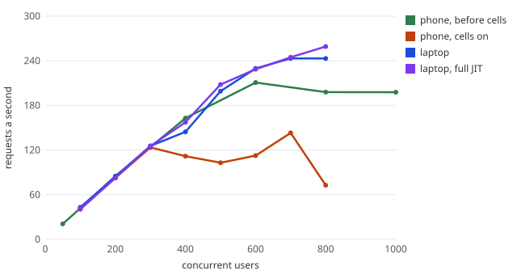
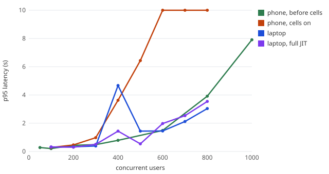
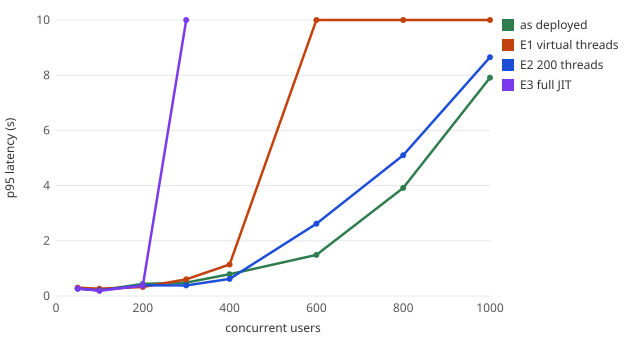
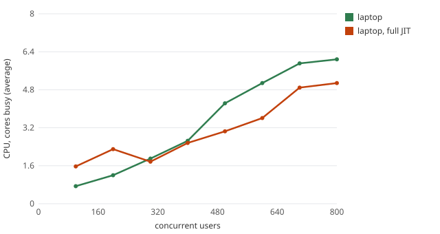
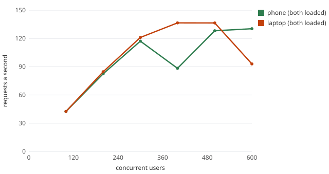
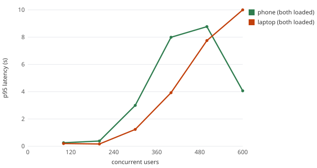

# Capacity

How many people can use Sprout at once on what it runs on for free: an Android phone (cell A) and a laptop
(cell B), each a whole Sprout ([ADR-027](../decisions.md#adr-027-cells)), reached through Cloudflare.

## The answer

A step passes when its **p95 latency is under 1 s and under 1% of requests fail**, and every smaller step
passed too. One "user" is a whole customer who pauses 2–6 s between actions, as people do. Each opens home,
checks quotes, looks at orders, pots and plans, buys a share, pays a shop by UPI (which triggers round-ups), and
now and then signs in again. One user makes about 0.42 requests a second.

| | Users within the target | Requests a second | Most it ever served |
|---|---|---|---|
| Phone (cell A), alone | **300** | 124 | 143 req/s |
| Laptop (cell B), alone | **300** | 125 | 259 req/s |
| **Both at once** | **400** (200 + 200) | 167 | 267 req/s |
| Promised with one cell lost | ~200 (estimate, not yet measured) | | |

**400 people using Sprout at the same time, with p95 under a second**, on a phone and a laptop that cost nothing
to run. Through the public address each request also crosses Cloudflare, which adds 120–170 ms at p50
(measured: 11 ms locally against 178 ms through `sprout-saiworks.nncs.in`).

Why "both at once" isn't 300 + 300: the load generator for both cells runs on the laptop, so in the combined test
it takes the laptop's CPU, and each cell also journals the other's writes ([ADR-027](../decisions.md#adr-027-cells)).
The 400 is what was measured, not a sum.

New customers are split between the cells **35 : 65**, the ratio of what each served at most (143 : 259 req/s).

What can be **promised** is less than what both carry together: if a cell is lost, the other runs its customers
too, on top of a standby JVM. Running each cell at about 200 users leaves that headroom.

## Each cell alone

- **Both cells serve the same 125 req/s up to 300 users.** Past that, the laptop keeps climbing to about 250
  req/s, and the phone flattens at about 140. Both bend on CPU: the phone at 6 to 7 of its 8 cores, and the
  laptop, which shares its 8 threads with the load generator, the same way.
- **Cells cost the phone about a third of its peak** (211 → 143 req/s). With cells, the phone also runs the
  replication tunnel to the laptop (with the front-door tunnel, `cloudflared` took 20–30% of a core under load). Postgres decodes every
  change for the laptop's copy, and the gateway journals each write into the other cell. The phone also ran at
  40–41 °C against 37 °C before. The cost of losing no acknowledged write is paid in CPU, on the machine that has
  least of it.
- **The single 4.7 s point** in the laptop's line (400 users) is one noisy step: its CPU was at 5.3 of 8 cores,
  and 500 users then did better. Each step is one minute, so one long garbage collection or JIT burst shows.

## What was tried, and what was kept

| | Experiment | Result | Kept? |
|---|---|---|---|
| E1 | Virtual threads in every service (phone) | Froze at 600 users: with 2 carrier threads, JDK 21 pins a virtual thread inside `synchronized`, and the edge host deadlocked ([incident](../incidents.md)) | No |
| E2 | The edge host's Tomcat threads 32 → 200 (phone) | Better at 300–400 users, worse past 600: more threads queue on the same 8 cores | No |
| E3 | Full JIT (C2) on every host (phone) | The phone dropped off the network compiling at 300 users | No |
| E4 | Full JIT (C2) and a parallel collector on the **laptop's** hosts | A fifth to a third less CPU per request (at 500 users, 3.0 cores against 4.2), +6% peak; ~40 MB more per host | **Yes** |
| | nginx: 256 → 4096 connections (phone) | The first "breaking point" was nginx's connection limit, not Sprout | Yes |
| | Load through the LAN, not an SSH tunnel | The tunnel's encryption ran on the phone's CPU and was measuring itself | Yes (method) |

The phone's JVM settings (C1 only, serial GC, small heaps, `ActiveProcessorCount=2`) are the result: on 8 slow
cores and 7 GB shared with Android, every attempt to make the JVM "faster" made the phone worse. The laptop has
headroom, so it gets the faster JVM.

## Both at once

At 500 users the laptop's gateway returned 1,033 `503`s in a minute. These were its circuit breaker: `oms` had
started timing out, so the gateway answered "try again in a few seconds" at once, instead of queueing more work
on a service that was already behind. The load was shed, nothing broke, and the next step served again.

## What the overload taught (and fixed)

Pushing past the limit was the point, and it found three places where **slow was mistaken for dead**:

1. **cellwatch took over an overloaded cell.** At 800 users the laptop answered so slowly that the phone
   counted it as lost and took its customers over, while the laptop was still serving them. Now a cell is lost
   only when its address doesn't answer at all; a sick cell gets ten minutes and fences itself after five.
2. **cellwatch took over a cell whose watcher had restarted.** Now the other cell's front door is checked as well
   as its status file.
3. **The phone's starter killed an overloaded edge host** as hung, and its two-minute restart turned an overload
   into an outage. Now a silent process is killed only if it has also stopped using CPU.

The [incident](../incidents.md) has the timeline. Since the fixes, the laptop has run at 800 users with both
cells staying NORMAL.

## The other tests

From the same tools, on the phone before cells:

| Test | Result |
|---|---|
| Sign-ins (bcrypt, the costliest request there is) | **10 a second** within target (p95 0.37 s); at 12, p95 goes past 5 s and 20% fail |
| Live price streams held open | **400 at once**, all opened; at 800, only about 500 open. Price ticks arrive p95 0.5 s late at 100 streams and 1.1 s at 200–400, and a client that falls behind misses ticks in between |
| Screens a second (signed in, no pauses) | **20 a second** within target (p95 0.2 s); at 40, p95 goes to 26 s |

## Live site

The site at the time of these runs, through the public address:

{ width="640" }
{ width="200" }

## How it was measured

- [`capacity/run.py`](https://github.com/SaiNayakk/sprout-platform/blob/main/capacity/run.py) climbs in one-minute
  steps with [k6](https://github.com/SaiNayakk/sprout-platform/blob/main/capacity/k6/cap.js). Nothing aborts a
  run: a failed step is a result.
- **Phone:** load arrives over Wi-Fi through a test-only listener that is switched on for the run, so neither
  Cloudflare's limits nor a tunnel's encryption is what gets measured. [`sample.py`](https://github.com/SaiNayakk/sprout-platform/blob/main/capacity/sample.py)
  reads CPU, proportional memory and battery temperature from `/proc` every 2 s.
- **Laptop:** k6 joins the cell's Docker network, held to 2 CPUs so its own cost is bounded, and `docker stats`
  is sampled every 2 s.
- **Not done:** a public load test from one machine. Cloudflare sets the client address, so a thousand virtual
  users would be one visitor to the per-client rate limits, and the test would measure the limiter.
- Every run's numbers are kept: [`capacity-runs/`](https://github.com/SaiNayakk/sprout-platform/tree/main/docs/reliability/capacity-runs),
  one `result.json` each (per step: load, throughput, latency percentiles, errors by status, and CPU and
  memory per process). The charts are drawn from them by [`capacity/chart.py`](https://github.com/SaiNayakk/sprout-platform/blob/main/capacity/chart.py).
