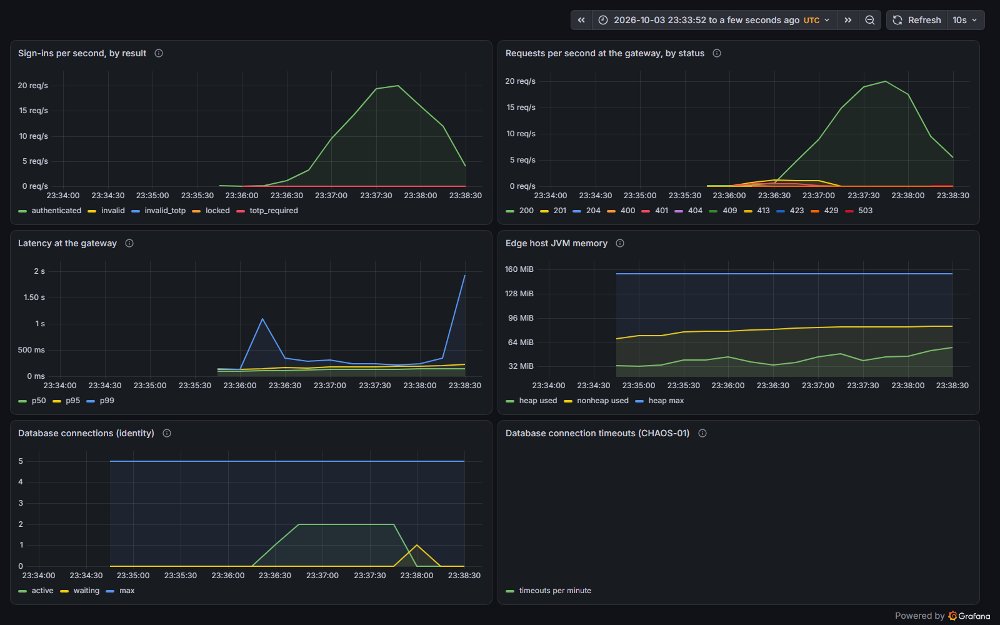

# Pre-prod run 2026-10-03-2333-preprod

A fresh environment built from the pinned release, tested, then destroyed. Raw evidence sits next to this page.

## Release under test

| Component | Version |
|---|---|
| sprout-gateway | `v0.1.0` |
| sprout-identity | `v0.2.1` |
| sprout-platform | `efc5d8b` |

## Result

| Stage | Result |
|---|---|
| environment | ✅ pass |
| e2e | ✅ pass |
| perf-01 | ✅ pass |
| chaos-01 | ✅ pass |

## End-to-end suite

16 of 16 passed.

| Id | Journey or edge case | Time | Result |
|---|---|---|---|
| E2E-01 | sign up, sign in and see your account | 0.3 s | ✅ pass |
| E2E-02 | turn on two-factor, then sign in with a code | 29.6 s | ✅ pass |
| E2E-03 | refresh tokens rotate; sign out ends the session | 0.5 s | ✅ pass |
| E2E-10 | duplicate email, any case or spacing, is refused | 0.1 s | ✅ pass |
| E2E-11 | weak passwords are refused with a reason | 0.1 s | ✅ pass |
| E2E-12 | malformed JSON and unknown fields are refused | 0.0 s | ✅ pass |
| E2E-20 | wrong password and unknown email look identical | 0.3 s | ✅ pass |
| E2E-21 | five wrong passwords lock the account, even for the right one | 0.7 s | ✅ pass |
| E2E-22 | a two-factor code works once and a challenge only once | 10.3 s | ✅ pass |
| E2E-30 | a stolen refresh token, used after the owner, ends the session | 0.3 s | ✅ pass |
| E2E-31 | two refreshes racing with one token: exactly one wins | 2.1 s | ✅ pass |
| E2E-32 | missing, tampered and junk tokens are refused at the gateway | 0.3 s | ✅ pass |
| E2E-33 | a client can't pretend to be someone else with X-User-Id | 0.3 s | ✅ pass |
| E2E-34 | sign-in is rate limited per client | 1.1 s | ✅ pass |
| E2E-35 | unknown routes, path traversal and oversized bodies are refused | 0.8 s | ✅ pass |
| E2E-36 | one request id follows a request through the gateway and identity | 0.1 s | ✅ pass |

## PERF-01: sign-in throughput

First 30 s: ramp from 2 to 20 sign-ins a second on a freshly started JVM. Then 60 s steady at 20 a second. Every request from a different client.

| Measure | Warm-up (30 s) | Steady (60 s) |
|---|---|---|
| Median | 126 ms | 136 ms |
| p95 | 159 ms | 196 ms |
| p99 | 206 ms | 255 ms |
| Slowest | 362 ms | 370 ms |
| Requests | 329 | 1201 |
| Failed | 0.00% | 0.00% |

Edge host peak memory: 220 MiB of a 384 MiB limit.

| Threshold | Rule | Result |
|---|---|---|
| `http_req_duration{scenario:warmup}` | `p(99)<3000` | ✅ pass |
| `checks{scenario:steady}` | `rate>0.99` | ✅ pass |
| `http_req_failed{scenario:warmup}` | `rate<0.01` | ✅ pass |
| `http_req_duration{scenario:steady}` | `p(95)<500` | ✅ pass |
| `http_req_duration{scenario:steady}` | `p(99)<1000` | ✅ pass |
| `http_req_failed{scenario:steady}` | `rate<0.01` | ✅ pass |

## CHAOS-01: the database goes away

Hypothesis: with Postgres stopped, sign-in answers `503` with `Retry-After` in under 3 s (it never hangs until the gateway's 5 s timeout), and recovers within 30 s of Postgres returning, without a restart.

| Moment | Status and time |
|---|---|
| Before (wrong password, so `401` is healthy) | `401` in 135 ms |
| Database down, try 1 | `503` in 2,028 ms |
| Database down, try 2 | `503` in 2,009 ms |
| Database down, try 3 | `503` in 2,005 ms |
| `Retry-After` header | 5 s |
| Answering normally again after Postgres started | 7 s |
| Edge host restarts | 0 |

## Dashboard

The edge host's Grafana dashboard for the whole run, captured automatically: the sign-in load, then the database outage.

## Files

- `e2e/`: JUnit reports
- `perf-01-k6-summary.json`: every k6 metric
- `memory-during.txt`: edge host memory and CPU every 5 s under load
- `chaos-01.json`: raw chaos timings
- `edge.log`: the edge host's structured logs for the whole run
- `metrics.jsonl`: counters queried from Prometheus at the end of the run
