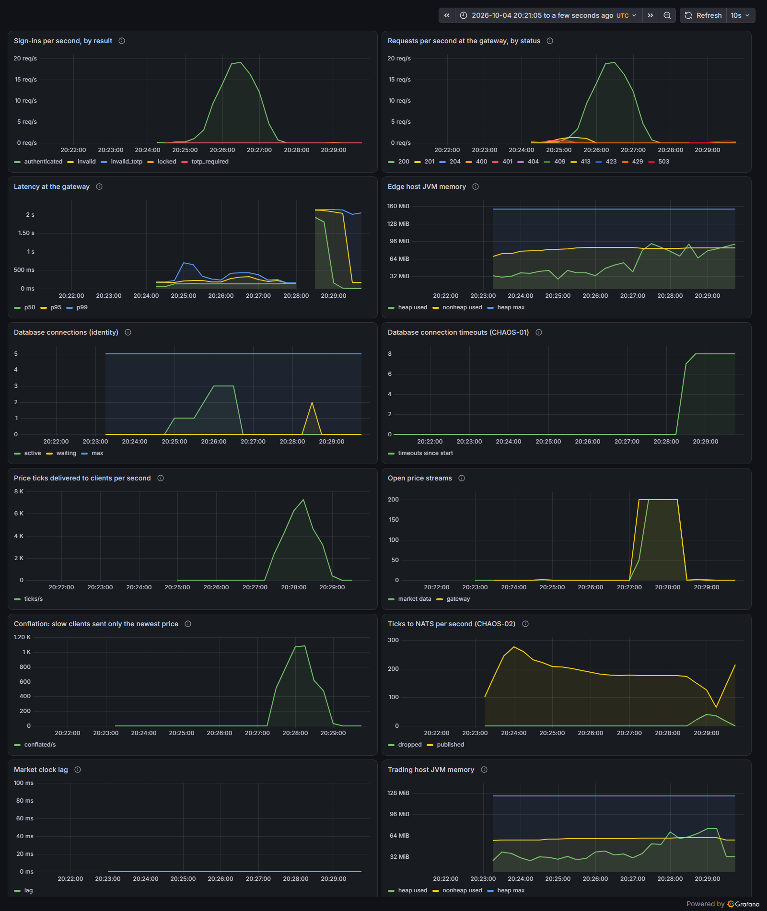

# Pre-prod run 2026-10-04-2021-preprod

A fresh environment built from the pinned releases, tested, then destroyed. Raw evidence sits next to this page.

## Release under test

| Host | Service | Version |
|---|---|---|
| edge | sprout-identity | `0.2.1` |
| edge | sprout-gateway | `0.2.4` |
| trading | sprout-marketdata | `0.1.0` |
| | sprout-platform | `v0.1.0-dirty` |

## Result

| Stage | Result |
|---|---|
| environment | ✅ pass |
| e2e | ✅ pass |
| perf-01 | ✅ pass |
| perf-03 | ✅ pass |
| chaos-01 | ✅ pass |
| chaos-02 | ✅ pass |
| chaos-03 | ✅ pass |

## End-to-end suite

24 of 24 passed.

| Id | Journey or edge case | Time | Result |
|---|---|---|---|
| [E2E-01](../../../testing/e2e.md#e2e-01) | sign up, sign in and see your account | 0.3 s | ✅ pass |
| [E2E-02](../../../testing/e2e.md#e2e-02) | turn on two-factor, then sign in with a code | 29.6 s | ✅ pass |
| [E2E-03](../../../testing/e2e.md#e2e-03) | refresh tokens rotate; sign out ends the session | 0.4 s | ✅ pass |
| [E2E-10](../../../testing/e2e.md#e2e-10) | duplicate email, any case or spacing, is refused | 0.2 s | ✅ pass |
| [E2E-11](../../../testing/e2e.md#e2e-11) | weak passwords are refused with a reason | 0.1 s | ✅ pass |
| [E2E-12](../../../testing/e2e.md#e2e-12) | malformed JSON and unknown fields are refused | 0.0 s | ✅ pass |
| [E2E-20](../../../testing/e2e.md#e2e-20) | wrong password and unknown email look identical | 0.5 s | ✅ pass |
| [E2E-21](../../../testing/e2e.md#e2e-21) | five wrong passwords lock the account, even for the right one | 1.0 s | ✅ pass |
| [E2E-22](../../../testing/e2e.md#e2e-22) | a two-factor code works once and a challenge only once | 11.2 s | ✅ pass |
| [E2E-30](../../../testing/e2e.md#e2e-30) | a stolen refresh token, used after the owner, ends the session | 0.5 s | ✅ pass |
| [E2E-31](../../../testing/e2e.md#e2e-31) | two refreshes racing with one token: exactly one wins | 1.7 s | ✅ pass |
| [E2E-32](../../../testing/e2e.md#e2e-32) | missing, tampered and junk tokens are refused at the gateway | 0.3 s | ✅ pass |
| [E2E-33](../../../testing/e2e.md#e2e-33) | a client can't pretend to be someone else with X-User-Id | 0.5 s | ✅ pass |
| [E2E-34](../../../testing/e2e.md#e2e-34) | sign-in is rate limited per client | 1.7 s | ✅ pass |
| [E2E-35](../../../testing/e2e.md#e2e-35) | unknown routes, path traversal and oversized bodies are refused | 0.8 s | ✅ pass |
| [E2E-36](../../../testing/e2e.md#e2e-36) | one request id follows a request through the gateway and identity | 0.1 s | ✅ pass |
| [E2E-40](../../../testing/e2e.md#e2e-40) | the market and its instruments are visible before signing in | 0.5 s | ✅ pass |
| [E2E-41](../../../testing/e2e.md#e2e-41) | prices need a signed-in user | 0.3 s | ✅ pass |
| [E2E-42](../../../testing/e2e.md#e2e-42) | quotes come back in the order asked; unknown symbols are named | 0.4 s | ✅ pass |
| [E2E-43](../../../testing/e2e.md#e2e-43) | candles never show the future | 0.5 s | ✅ pass |
| [E2E-44](../../../testing/e2e.md#e2e-44) | the price stream starts with the current state, then ticks live with rising seq | 2.3 s | ✅ pass |
| [E2E-45](../../../testing/e2e.md#e2e-45) | every streamed price lies inside its minute's high and low | 9.2 s | ✅ pass |
| [E2E-46](../../../testing/e2e.md#e2e-46) | one client can hold at most five price streams | 0.4 s | ✅ pass |
| [E2E-47](../../../testing/e2e.md#e2e-47) | a bad stream request is refused before it starts | 0.6 s | ✅ pass |

## PERF-01: sign-in throughput

First 30 s: ramp from 2 to 20 sign-ins a second on a freshly started JVM. Then 60 s steady at 20 a second. Every request from a different client.

| Measure | Warm-up (30 s) | Steady (60 s) |
|---|---|---|
| Median | 130 ms | 128 ms |
| p95 | 206 ms | 313 ms |
| p99 | 324 ms | 472 ms |
| Slowest | 823 ms | 808 ms |
| Requests | 330 | 1200 |
| Failed | 0.00% | 0.00% |

| Threshold | Rule | Result |
|---|---|---|
| `http_req_duration{scenario:steady}` | `p(99)<1000` | ✅ pass |
| `http_req_duration{scenario:steady}` | `p(95)<500` | ✅ pass |
| `http_req_duration{scenario:warmup}` | `p(99)<3000` | ✅ pass |
| `checks{scenario:steady}` | `rate>0.99` | ✅ pass |
| `http_req_failed{scenario:warmup}` | `rate<0.01` | ✅ pass |
| `http_req_failed{scenario:steady}` | `rate<0.01` | ✅ pass |

## PERF-03: price fan-out

200 clients, each streaming 5 symbols through the gateway for 60 s. Latency is from the moment market data produced a tick to the moment a client read it, measured on one clock.

| Measure | Value |
|---|---|
| Streams opened | 200 of 200 |
| Streams that ended early | 0 |
| Ticks delivered | 451,402 (7,523 a second) |
| Delivery latency p50 / p95 / p99 / max | 17 ms / 90 ms / 296 ms / 1,096 ms |
| Conflated (a client got only the newest price) | 47,781 times, 10.6% of ticks |

Pass when every stream opens and stays open, p95 is under 250 ms and p99 under 1 s.

## Memory under load

| Host | Peak | Limit |
|---|---|---|
| edge | 272 MiB | 384 MiB |
| trading | 207 MiB | 256 MiB |

## CHAOS-01: The database goes away

Hypothesis: With Postgres stopped, sign-in answers 503 with Retry-After in under 3 s (never hanging until the gateway's 5 s timeout), and recovers within 30 s of Postgres returning, without a restart.

| Observed | |
|---|---|
| Before (wrong password, so 401 is healthy) | 401 in 280 ms |
| Database down, try 1 | 503 in 2,110 ms |
| Database down, try 2 | 503 in 2,097 ms |
| Database down, try 3 | 503 in 2,119 ms |
| Retry-After | 5 |
| Answering normally again after Postgres started | 7.2 s |

| Check | Result |
|---|---|
| 503 UPSTREAM_UNAVAILABLE every time | ✅ pass |
| each in under 3 s | ✅ pass |
| with Retry-After | ✅ pass |
| recovered within 30 s without a restart | ✅ pass |

## CHAOS-02: NATS goes away

Hypothesis: With NATS stopped, prices keep streaming to clients and quotes keep working; the trading host stays healthy. When NATS returns, market data reconnects by itself within 30 s and publishes again.

| Observed | |
|---|---|
| NATS connected before | True |
| Ticks streamed to a client in the 10 s NATS was down | 170 |
| Trading host health while NATS was down | UP |
| Quote while NATS was down | 200 in 27 ms |
| Reconnected after NATS started | 0.7 s |
| Events published in 3 s after reconnecting | 636 |

| Check | Result |
|---|---|
| prices kept streaming | ✅ pass |
| the stream stayed open | ✅ pass |
| the host stayed healthy | ✅ pass |
| quotes kept working | ✅ pass |
| reconnected within 30 s | ✅ pass |
| publishing again | ✅ pass |

## CHAOS-03: The trading host dies

Hypothesis: With the trading host killed, sign-in and accounts are unaffected (they run in a different JVM). Market data answers 503 within 3 s instead of hanging, open price streams end within 5 s so clients know to reconnect, and market data is back within 60 s of the host restarting.

| Observed | |
|---|---|
| Open stream ended after the kill | 0.0 s |
| Sign-in (wrong password, so 401 is healthy) | 401 in 138 ms |
| My account | 200 in 22 ms |
| A quote | 503 in 2,099 ms (UPSTREAM_UNAVAILABLE) |
| Opening a new stream | 503 in 2,089 ms |
| Quotes working again after restart | 18.3 s |
| Edge host | Up 6 minutes (healthy) |

| Check | Result |
|---|---|
| sign-in unaffected | ✅ pass |
| accounts unaffected | ✅ pass |
| quotes fail fast with 503 | ✅ pass |
| new streams refused fast | ✅ pass |
| open streams end within 5 s | ✅ pass |
| market data back within 60 s | ✅ pass |

## Dashboard

The Grafana dashboard for the whole run, captured automatically.

## Files

- `e2e/`: JUnit reports
- `perf-01-k6-summary.json`: every k6 metric
- `perf-03-summary.json`: the fan-out result
- `memory-during.txt`: host memory and CPU every 5 s under load
- `chaos-*.json`: each experiment's observations and checks
- `edge.log`, `trading.log`: the hosts' structured logs for the whole run
- `metrics.jsonl`: counters queried from Prometheus at the end of the run
