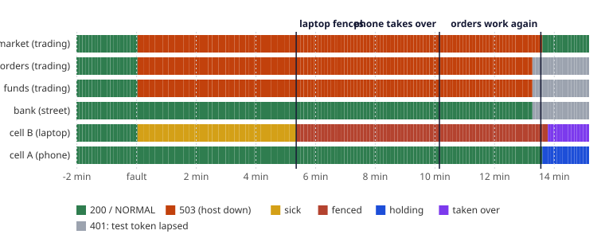
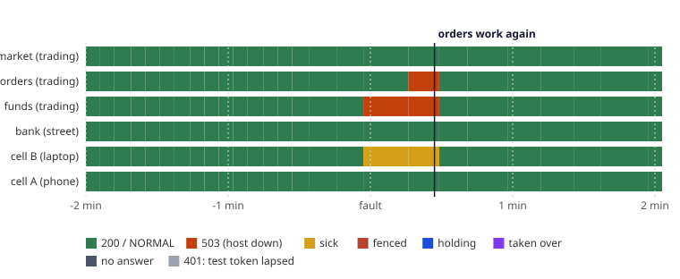
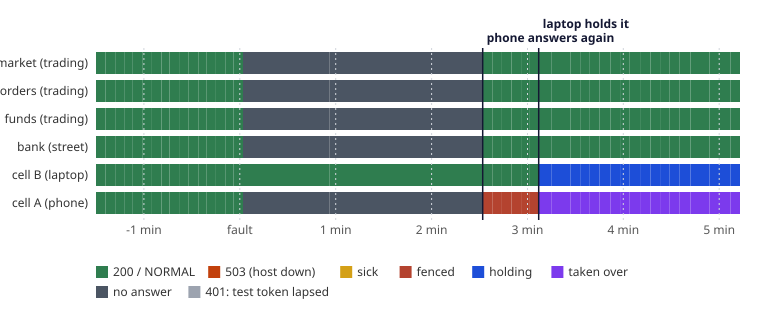

# Chaos tests

A chaos experiment breaks one thing on purpose and checks that the system behaves the way we claim it
does. Each has a **steady state** (what normal looks like), a **hypothesis** (what should happen when
the thing breaks), a **method**, and a pass condition. They run automatically in pre-prod.

Every experiment starts from a steady state: the run waits until every host's health check passes
(each checks all the services in that host, not only the first one to start), because the experiment
before may have just restarted one.

## TRACE-01: one request, followed through every service { #trace-01 }

Not a fault but a check, run first: an order is placed with a known request id and a forged `traceparent`
from the client. Every log line any host writes for that request id (the order service booking it, the
exchange filling it) must carry the same trace id, and that trace must be the gateway's own, never the
client's. Read from the hosts' structured logs, so it runs on every pre-prod run, with or without trace
export.

## CHAOS-01: the database goes away { #chaos-01 }

| | |
|---|---|
| **Steady state** | A sign-in with a wrong password gets `401` quickly. |
| **Fault** | Stop the Postgres container. |
| **Hypothesis** | Sign-in answers `503 UPSTREAM_UNAVAILABLE` with a `Retry-After` header in **under 3 s**, never hanging until the gateway's 5 s timeout. When Postgres comes back, identity recovers **within 30 s, without a restart**. |
| **Method** | [`preprod/chaos.py`](https://github.com/SaiNayakk/sprout-platform/blob/main/preprod/chaos.py): probe, `docker compose stop postgres`, probe three times, `start postgres`, probe every second until healthy. |

### What happened

The first time this ran (manually, before automation), **the hypothesis was disproved**:

| | Expected | Got |
|---|---|---|
| Status while down | `503` with `Retry-After` | `504` from the gateway |
| Time to answer | under 3 s | 5 s: identity was still waiting for a database connection when the gateway gave up |

The cause was in identity, and fixing it surfaced a second one:

1. The connection pool waited the default 30 s for a connection, so identity never answered before the
   gateway's 5 s timeout.
2. The regression test for the fix (below) then failed in CI with a `500`: depending on timing, the
   error arrives as a failed rollback after a lost connection (`TransactionSystemException` wrapping
   SQL state `08006`), which the problem handler didn't recognise as "database unreachable".

The fix, released as identity `v0.2.1`:

- Pool `connection-timeout` 2 s and `validation-timeout` 1 s, so identity decides well inside the
  gateway's budget.
- The problem handler walks the whole cause chain for any connection failure (SQL state class `08`,
  socket errors, Spring's resource-failure exceptions, and failed rollbacks) and answers
  `503 UPSTREAM_UNAVAILABLE` with `Retry-After: 5`.
- The contract added the `503` first ([contracts `v0.2.0`](../contracts.md#versioning)).
- Unit tests for each wrapped form, and a Testcontainers test that stops a real Postgres mid-test and
  checks for a contract-valid `503` in under 4 s.

Re-run against `v0.2.1`: `503` in about 2.0 s with `Retry-After: 5`, recovery in seconds, no restart.
Every pre-prod run since repeats the experiment; results are in
[Evidence from runs](../reliability/runs/index.md).

## CHAOS-02: NATS goes away { #chaos-02 }

| | |
|---|---|
| **Steady state** | Market data is connected to NATS and publishing a `marketdata.tick` event per price change; clients are streaming prices. |
| **Fault** | Stop the NATS container for 10 seconds. |
| **Hypothesis** | Prices keep streaming to clients, quotes keep working and the trading host stays healthy. When NATS returns, market data reconnects by itself within 30 s and publishes again. |
| **Method** | Open a price stream, stop NATS, count ticks for 10 s, check health and a quote, start NATS, wait for reconnection, then read NATS's own message count to see publishing resume. |

**Why it should hold.** NATS is how other services will hear about prices, but clients are served
directly. Market data connects to NATS in the background, reconnects forever, and while disconnected
drops (and counts) events instead of queueing them: a tick is out of date within seconds, so a backlog
delivered after an outage would be worse than a gap.

In the first trial run: 168 ticks streamed during the outage, quotes answered in 20 ms, the host stayed
`UP`, it reconnected 0.6 s after NATS started, and 564 events were published in the following 3 s.

## CHAOS-03: the trading host dies { #chaos-03 }

| | |
|---|---|
| **Steady state** | A client is signed in and streaming prices. |
| **Fault** | `docker compose kill trading`: the whole JVM, without warning. |
| **Hypothesis** | Sign-in and accounts are unaffected, because they run in a different JVM. Market data answers `503` within 3 s instead of hanging, open price streams end within 5 s so clients know to reconnect, and market data is back within 60 s of the host restarting. |
| **Method** | Open a stream, kill the host, then: time how long the stream takes to end, sign in, read the account, ask for a quote and a new stream, restart the host and poll quotes until they work. |

This is the reason the trading services run in their own host rather than inside the edge host
([ADR-010](../decisions.md#adr-010-trading-host)): a fault in market data, or later in orders, must
never stop people signing in.

### What happened

The first run **disproved part of the hypothesis**. Sign-in, accounts, the open stream ending and the
recovery all passed, but quotes and new streams got **`504` after 2 s** instead of `503`.

| | Expected | Got |
|---|---|---|
| Quote while the host is down | `503` with `Retry-After`: not reachable, safe to retry | `504` "took too long; it may still have happened" |

**Cause.** A killed container's network name still resolves, but nothing answers at that address, so
the gateway's 2 s *connect* timeout expired. The gateway treated that like a *response* timeout. The
two mean different things to a client: after a response timeout the service may have acted on the
request; after a connect timeout it certainly never received it.

**Why it matters.** For prices it's cosmetic. For orders it decides whether a client may simply retry
or must first check whether the order went through. Getting it wrong either way means duplicate
orders or needlessly abandoned ones.

**Fix:** gateway `v0.2.3` answers a connect timeout with `503 UPSTREAM_UNAVAILABLE` and
`Retry-After: 5`, for normal requests and streams, with a regression test against an address that
never answers.

## CHAOS-04: Sprout Bank goes away mid-withdrawal { #chaos-04 }

| | |
|---|---|
| **Steady state** | A customer has ₹1,000 in Sprout. |
| **Fault** | Stop the street host (Sprout Bank), then withdraw ₹400. |
| **Hypothesis** | The withdrawal is accepted and the money held (available ₹600, withdrawing ₹400): never refused, never lost, never paid twice. When the bank returns, the reconciler finishes it within 90 s and the bank receives ₹400 exactly once. |

First run: accepted as `PROCESSING` in 2.1 s with the money held; completed 9.2 s after the bank came
back; the customer's bank received exactly ₹400.

## CHAOS-05: payments is down when the customer approves { #chaos-05 }

| | |
|---|---|
| **Steady state** | A customer has asked to add ₹750; the request waits in Sprout Bank. |
| **Fault** | Stop the money host, then approve the request in the bank with the PIN. |
| **Hypothesis** | The customer can still approve (the bank is up). The bank keeps the approval and retries telling payments; once the money host is back, the deposit completes within 120 s and is credited exactly once. |

First run: approved while payments was down; completed 10.2 s after the money host started; exactly one
ledger entry for the deposit.

## RECON-01: the books agree with the bank { #recon-01 }

Not a fault but a check, run last, after every test and failure above: the ledger balances (assets equal
liabilities), what the ledger says Sprout holds at the bank equals what Sprout Bank says Sprout holds, to the
paisa, and no withdrawal is left in progress. Real brokers reconcile like this every day; a difference
means money moved on one side only.

## CHAOS-06: the exchange goes away mid-order { #chaos-06 }

| | |
|---|---|
| **Steady state** | A customer has ₹20,000 in Sprout; the market is open. |
| **Fault** | Stop the street host (Sprout Bank and the exchange), then buy 2 shares at the market. |
| **Hypothesis** | The order is accepted with its money blocked and left `PENDING`: Sprout doesn't know whether the exchange got it, so it doesn't guess. When the exchange is back, the order service asks it, learns the order never arrived, rejects it within 120 s and gives back every paisa. |

The first run failed: the order was never given up on, its ₹3,597.77 left blocked (the reconciler measured
its 30 s from a timestamp that asking the exchange kept moving; see
[Incidents](../incidents.md)). After the fix: accepted as `PENDING` in 2.1 s with ₹3,593.37 blocked;
`REJECTED` as `UNAVAILABLE` 28.5 s after the exchange came back; cash back to exactly ₹20,000.00.

## CHAOS-07: the money host goes away during trading { #chaos-07 }

| | |
|---|---|
| **Steady state** | A customer has ₹20,000 in Sprout and has just bought 2 shares; the market is open. |
| **Fault** | Stop the money host (ledger, accounts, payments, settlement, statements, recon), then buy again. |
| **Hypothesis** | Trading fails safe: the order is refused at once with `503 UPSTREAM_UNAVAILABLE` and nothing is placed or blocked, while prices and the order list stay readable (they don't need the money host). When the money host is back, orders go through again within 180 s, and the customer's cash is exactly the deposit less every fill and its charges. |

Unlike CHAOS-06 (exchange down, so an order's fate is unknown and it is left `PENDING`), here nothing has
happened yet when the order service finds the books unreachable, so refusing is safe and honest.

## CHAOS-12: a whole cell is lost mid-load { #chaos-12 }

| | |
|---|---|
| **Steady state** | Both cells healthy, each replicating its database into the other; customers in the cell to be lost are funded and trading. |
| **Fault** | Replication from that cell is paused for its last 60 s (so its newest writes exist only in the journal), then its whole Sprout is stopped while its customers keep placing orders. |
| **Hypothesis** | The other cell takes its customers over ([ADR-027](../decisions.md#adr-027-cells)): every order the lost cell acknowledged is in the promoted copy exactly once, orders succeed again within minutes, and reconciliation in the takeover finds the books agree. |
| **Method** | [`deploy/cells/chaos12.py`](https://github.com/SaiNayakk/sprout-platform/blob/main/deploy/cells/chaos12.py), run against the live cells; each acknowledged order (its key and id) is written down as it happens, then looked for in the copy. |

**Cell A (the phone) lost, the laptop takes over:**

| | |
|---|---|
| Orders acknowledged | 1,226 |
| …of them only in the journal (replication paused) | 118 |
| **Missing after the takeover** | **0** |
| **Applied twice** | **0** |
| Orders succeed again after the kill | 167 s (the 120 s the other cell waits on purpose, then ~45 s: promote, start the standby, replay) |
| Journal replay | 808 writes: 120 applied, 616 already there (their keys), 72 refused (e.g. an account that exists), 0 failed |
| Reconciliation in the takeover | Everything agrees |

**What the first runs found.** The first run's standby couldn't start: Postgres allowed 100 connections and cell B's
own services used most of them (now 300 on both). The second took over correctly but its check crashed (the list of
order keys was too long for a Windows command line; it is now sent on stdin and written down as orders happen).
Before any run, the laptop tried to take over a phone that wasn't set up yet: a cell now takes over only one it has
seen healthy and holds a whole copy of, and a failed takeover waits ten minutes before trying again.

**Failback** ([`failback.sh`](https://github.com/SaiNayakk/sprout-platform/blob/main/deploy/cells/failback.sh)) then
moved cell A's customers home: the promoted copy became the phone's database (its own archived, never merged),
replication was set up again, and both cells went back to normal.

**Cell B (the laptop) lost, the phone takes over:**

| | |
|---|---|
| Orders acknowledged | 629 |
| …of them only in the journal (replication paused) | 151 |
| **Missing after the takeover** | **0** |
| **Applied twice** | **0** |
| Orders succeed again after the kill | 473 s (the first takeover was cut short; see below) |

**What this run found.** Two bugs, both on the phone's side, made the takeover take two tries:

- *cellwatch fell silent while taking over.* It wrote its status file only between checks, and a takeover (promote,
  start the standby, replay) takes minutes. The phone's starter saw a stale status for two minutes and killed it
  half-way. It now publishes its status from its own thread every 10 s, whatever else it is doing.
- *The standby couldn't read cell B's settings.* They were written on Windows with CRLF line endings, and Spring read
  a date as `2026-10-06\r`. `exchange-secrets.sh` now strips the CRs.

The second attempt took over in under a minute. Nothing was lost in between: the journal held every write, and the
copy didn't move until the replay. Failback then found a third bug: its `pkill -f cellwatch.py` over ssh matched its
own remote shell, which killed the script before it restarted the laptop's services and tunnel. Both are fixed.

**Cell A lost again, after the takeover rule changed** ([incident](../incidents.md): a cell is now lost only when
its address goes silent, not when it is slow):

| | |
|---|---|
| Orders acknowledged | 610 |
| …of them only in the journal (replication paused) | 137 |
| **Missing after the takeover** | **0** |
| **Applied twice** | **0** |
| Orders succeed again after the kill | 296 s (the journal held two hours of capacity-test writes: 3,184 replayed) |

**What this run found.** 17 replayed account openings failed with `503`. The second takeover of cell A had
moved the depository's `client_numbers` sequence to 1,000,000 again, onto demat numbers the first takeover
had already handed out. That sequence numbers `bo_id`, not a column of its own, so the takeover's "move past
the highest id" found nothing to look at. It and the sandbox's `demo_account_numbers` now have their highest
used values looked up. After a repair and another replay: 16 applied, 0 failed. None of the 17 had been
acknowledged: their first attempts had failed too, so no customer had been told they succeeded.

## CHAOS-16: one service in a cell fails, and the other cell takes over { #chaos-16 }

| | |
|---|---|
| **Steady state** | Both cells healthy and replicating; eight customers in cell B (the laptop) place market orders through the public address, each with its own idempotency key. |
| **Fault** | The laptop's *trading* host (orders, funds, market data) stops. Its web server, gateway and the bank stay up, so the cell's front door still answers. |
| **Hypothesis** | The cell is not "lost", only part-broken, so the rules are slower than for a whole cell ([ADR-027](../decisions.md#adr-027-cells)): it fences itself after 5 minutes of failing, and the phone takes it over after 10. Every order the laptop acknowledged is in the phone's copy exactly once. A host that comes back by itself is never taken over. |
| **Method** | [`deploy/cells/chaos16.py`](https://github.com/SaiNayakk/sprout-platform/blob/main/deploy/cells/chaos16.py). Every 5 s a probe, as a customer of cell B, calls one route behind each host and reads both cells' published state. Every acknowledged order is written down as it happens, then looked for in the database that serves cell B afterwards. `--mode stop` leaves the host down; `--mode kill` makes the JVM exit and lets Docker's restart policy bring it back. |

**The host stays down** (replication from cell B paused for the last 60 s, so its newest orders exist only in the journal):

| After the fault | What happened |
|---|---|
| 2 s | The three routes behind the trading host answer `503` at once; the bank route keeps answering. Cell B publishes itself as sick. |
| 321 s | Cell B **fences itself**: it takes no more writes. |
| 609 s | The phone counts cell B as lost (10 minutes unable to serve) and starts the takeover. |
| 725 s | The phone's copy of cell B's customers is promoted and its standby is up (116 s; slower than the usual 30 to 60 s). |
| 810 s | The journal is replayed: 968 writes, 315 applied, 605 already there (their keys), 48 refused, **0 failed**. |
| 813 s | **Orders succeed again.** The phone is HOLDING, and the laptop turns TAKEN_OVER. |

| | |
|---|---|
| Orders acknowledged | 294 |
| ...of them only in the journal (replication paused) | 132 |
| **Missing after the takeover** | **0** |
| **Applied twice** | **0** |
| Orders succeed again after the fault | 813 s |

During those 13.5 minutes the customers of cell B could browse the bank but could not trade: 581 of the test's order attempts got a `503`. The gateway answered fast each time (its circuit opens), so nothing hung. The wait is the price of the rule that slow is not lost; see the incidents of 2026-10-09 in [Incidents](../incidents.md).

**The host crashes and comes back** (the usual real failure):

| | |
|---|---|
| Orders acknowledged | 425 of 439 attempts |
| Errors | 13 `503` (customers retry with the same key, so each order was acknowledged once) |
| Orders succeed again after the fault | **27 s** |
| States seen | Cell B: NORMAL, briefly NORMAL/sick. **Cell A: NORMAL throughout.** No fence, no takeover. |
| Missing / applied twice | **0 / 0** |

**What the runs taught**

- A whole cell takes 2 to 5 minutes to replace ([CHAOS-12](#chaos-12)); one dead host takes 13.5, because it is slow rather than silent. Either way the customers lose trading for most of that time. What shortens it is the host coming back by itself (27 s here); failover is for a host that does not.
- Docker's restart policy ignores a container stopped by `docker kill` (a manual stop). The first attempt at the crash test left the host down for 5 minutes; a real crash, or the JVM exiting, is restarted.
- A returning cell has to wait before it unfences: after the host was started again, cell B stayed fenced for the 210 s the rule asks for (longer than the other cell needs to decide and promote) and then went NORMAL by itself.
- The test's own customers' tokens lapse after 15 minutes. They now sign in again on a `401`, as the app does.

## CHAOS-17: a cell's address goes silent, the other cell takes over, and the first comes back { #chaos-17 }

| | |
|---|---|
| **Steady state** | Both cells healthy and replicating; eight customers in cell A (the phone) place market orders through the public address, each with its own idempotency key. |
| **Fault** | The phone's web server is frozen (SIGSTOP) for 170 s: its public address stops answering while its process stays up. This is what a dropped tunnel looks like to the rest of the system, and what happened for real on 2026-10-09 ([incident](../incidents.md)). |
| **Hypothesis** | The phone fences itself, the laptop takes cell A over, and the phone, back before the laptop has finished, **stays out of service** and ends TAKEN_OVER, never going back to NORMAL. Only one database takes cell A's writes after the takeover, and no acknowledged order is lost or doubled. |
| **Method** | [`deploy/cells/chaos17.py`](https://github.com/SaiNayakk/sprout-platform/blob/main/deploy/cells/chaos17.py): both cells' published state every 5 s, every acknowledged order written down, then looked for in the laptop's copy; the phone's own database is asked whether it took any of those orders after the laptop began holding. `--verify RUN` repeats the checks on a finished run's files. |

| Seconds after the freeze (from the cells' logs) | |
|---|---|
| 60 | The phone **fences itself**. |
| 127 | The laptop counts the phone as lost (silent for 2 minutes) and starts taking cell A over. |
| 143 | The phone's starter, seeing the web server hung, kills it and starts it again; **the phone answers again**. It is fenced, and the laptop has not finished. |
| 163 | The laptop's standby is up. |
| 177 | The journal is replayed: 2,168 writes, 2,096 already there, 72 refused, **0 failed**. |
| 178 | The laptop is HOLDING cell A, and the phone, still fenced, becomes TAKEN_OVER. |

The phone was back for 35 s before the laptop was done. In that window the earlier rule unfenced the phone, which is how the split of 2026-10-09 began. Now it stayed fenced and went straight to TAKEN_OVER.

| | |
|---|---|
| Orders acknowledged | 517 of 566 attempts (33 `503`, 16 unanswered while the phone was silent) |
| **Missing from the laptop's copy** | **0** |
| **Applied twice** | **0** |
| **Phone's own database: orders taken after the laptop held** | **0** |
| Phone went back to NORMAL after fencing | **No** |
| Final state | Phone TAKEN_OVER with its fence in place; laptop HOLDING |

**The first run found a second bug.** With the starter as it was, the phone's starter killed the frozen nginx master as hung and tried to start it again, and **could not**: the master's two workers were orphaned, not killed with it, and still held the port. One failed restart made the starter give up on all of Sprout and stop it for ten minutes. The phone did not come back until twelve minutes later, long after the laptop had taken over (that run still passed its checks: 2,069 orders, 0 missing, 0 doubled, 0 taken by the phone). The starter now kills a hung piece's whole process tree and tries a failed restart once more before giving up ([incident](../incidents.md)).

## SETTLE-01: a trading day settles T+1 { #settle-01 }

Not a fault but the whole of settlement, run near the end, after the experiments above have stopped
and started every host. The run's first trade date (the E2E suite's) must settle within one session of
it: the clearing corporation nets the day, takes in sellers' shares and sends its obligation; Sprout's
back office finds it matches its books exactly (no break); the money moves through Sprout Bank; buyers'
shares reach their demat accounts; clients' sale proceeds become cash. No client may be short.

## RECON-02: orders, the exchange and the ledger agree { #recon-02 }

Run last, like RECON-01: every order Sprout booked as executed was executed by the exchange at the same
price and quantity, and the exchange executed nothing Sprout hasn't booked; for every customer, the money
the ledger holds for orders equals what their working orders and open positions say; every ledger entry
the order service decided on has been posted; no order is left waiting on the exchange.

## RECON-03: after settlement, shares and money agree everywhere { #recon-03 }

For every client, the shares in their demat account at the depository are exactly the delivered shares
Sprout shows them (holdings less T1); their unsettled money in the ledger is exactly the proceeds of days
not yet settled; and what the ledger says Sprout owes or is owed by the clearing corporation is exactly
the unsettled days' trades.

## RECON-04: Sprout's own reconciliation agrees { #recon-04 }

The last check of a run: Sprout's reconciliation service, which runs every day in production, is asked
to reconcile now. Every one of its seven checks must pass, reading through the services' APIs what the
SQL checks above read from their databases.

## Planned

| Id | Fault | Hypothesis |
|---|---|---|
| CHAOS-08 | Postgres slows to 3 s per query (network latency injected) | Requests fail inside the gateway budget; no thread pile-up; memory stays under the limit |
| CHAOS-09 | Edge host killed mid-traffic | Supervisor restarts it; clients see errors for under 30 s; no half-written sessions |
| CHAOS-10 | Signing key rotated while tokens are live | Old tokens keep working until they expire; new tokens use the new key |
| CHAOS-11 | Disk fills on the database volume | Writes fail with `503`, reads keep working, nothing corrupts |
| CHAOS-12 | A whole cell is lost mid-load | Done: see [CHAOS-12](#chaos-12) |
| CHAOS-13 | The market clock stalls (engine thread stuck) | Health turns `DOWN` within 30 s; the host is restarted; clients resync |
| CHAOS-14 | The order service is down when the exchange executes a resting order | The exchange keeps the execution and retries; once orders is back, it is booked exactly once |
| CHAOS-15 | Identity's context crashes inside the edge host | Gateway answers `503` fast; circuit opens after repeated failures and closes after recovery |
| CHAOS-16 | One host of a cell stops while its front door stays up | Done: see [CHAOS-16](#chaos-16) |
| CHAOS-17 | A cell's address goes silent for nearly 3 minutes, then returns | Done: see [CHAOS-17](#chaos-17) |
| CHAOS-18 | Both cells lose the internet at once, then get it back | Both fence; neither takes the other over; both unfence after staying healthy for 3.5 minutes; nothing is lost or doubled |
| CHAOS-19 | A tunnel flaps: 30 s down every 2 minutes for 20 minutes | No fence, no takeover, no routing flip-flop; customers see short errors only |
| CHAOS-20 | Replication stops for 30 minutes, then the cell is lost | The journal covers the gap; the lost cell's WAL on the surviving side stays bounded (no full disk) |
| CHAOS-21 | The other cell is unreachable for the journal, then this cell is lost | The writes made meanwhile are counted as "unprotected", and the number lost never exceeds that count |
| CHAOS-22 | One cell lost while both are loaded to their promised capacity | The survivor serves both cells' customers within the target; if it can't, the measured number replaces the estimate in [Capacity](../reliability/capacity.md) |
| CHAOS-23 | The phone reboots (power, Android) while the laptop holds its customers | The phone starts piece by piece, comes back fenced, and takes nothing until failback |
| CHAOS-24 | A takeover lands on a day a plan is due (the 5th) and across a settlement | Each plan buys once and each settlement runs once across the takeover |
| CHAOS-25 | One host answers every request after 8 s (injected delay) | Customers get a fast `503`, not a hang; the cell is neither fenced nor taken over inside its limits |
| CHAOS-26 | A forged cell key, replay or client address reaches the journal and replay endpoints | Refused; nothing is written |
